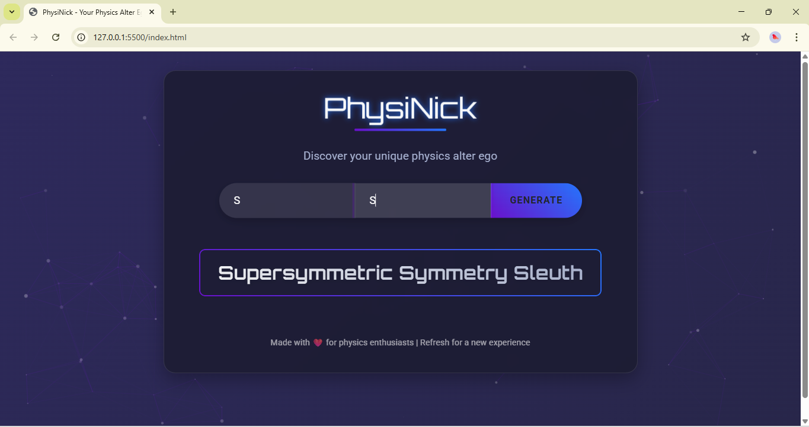

# PhysiNick - Your Physics Alter Ego



A fun and interactive web application that generates unique physics-themed nicknames based on your initials. Discover your inner physicist with this beautifully designed, animated nickname generator!

## 🌟 Live Demo

**Try it now:** [https://physinick-v1.netlify.app/](https://physinick-v1.netlify.app/)

## ✨ Features

- **Interactive Nickname Generation**: Enter your first and last name initials to get a unique physics-themed nickname
- **Beautiful UI**: Modern dark theme with gradient backgrounds and particle animations
- **Smooth Animations**: Floating title, typewriter effects, and confetti celebrations
- **Responsive Design**: Works perfectly on desktop and mobile devices
- **Physics Terms**: Comprehensive database of physics concepts and terminology
- **Auto-focus**: Smart input navigation that moves between fields automatically

## 🎯 How It Works

1. Enter your first name initial (A-Z)
2. Enter your last name initial (A-Z)
3. Click "Generate" or press Enter
4. Watch your physics alter ego come to life with a typewriter effect!

### Example Results
- **S + S** → "Supersymmetric Symmetry Sleuth"
- **Q + M** → "Quantum Magnon Magician"
- **E + R** → "Entangled Resonance Ranger"

## 🛠️ Technologies Used

- **HTML5**: Semantic markup and structure
- **CSS3**: Modern styling with gradients, animations, and responsive design
- **JavaScript (ES6+)**: Interactive functionality and animations
- **Bootstrap 5**: Responsive grid system and components
- **Particles.js**: Interactive particle background effects
- **Animate.css**: Smooth CSS animations
- **Canvas Confetti**: Celebration effects
- **Google Fonts**: Orbitron and Roboto typography

## 📁 Project Structure

```
PhysiNick/
├── index.html              # Main HTML file
├── assets/
│   ├── css/
│   │   └── main.css        # Custom styles and animations
│   ├── js/
│   │   └── main.js         # JavaScript functionality
│   └── img/
│       ├── Demonstration.png
│       └── Overview.png
├── README.md
├── License.md
└── .gitignore
```

## 🚀 Getting Started

### Prerequisites
- A modern web browser
- A local web server (optional, for development)

### Installation

1. **Clone the repository**
   ```bash
   git clone https://github.com/yourusername/physinick.git
   cd physinick
   ```

2. **Open in browser**
   - Simply open `index.html` in your web browser, or
   - Use a local server like Live Server (VS Code extension) or Python's built-in server:
     ```bash
     python -m http.server 8000
     ```

3. **Start generating nicknames!**

## 🎨 Customization

### Adding New Physics Terms

Edit the `firstNames` and `lastNames` objects in `assets/js/main.js`:

```javascript
const firstNames = {
  A: "Adiabatic",
  B: "Bogoliubov",
  // Add your own terms here
};

const lastNames = {
  A: "Annihilator",
  B: "Boundary Bard",
  // Add your own terms here
};
```

### Styling Changes

Modify the CSS variables in `assets/css/main.css`:

```css
:root {
  --primary: #6a11cb;    /* Primary color */
  --secondary: #2575fc;  /* Secondary color */
  --dark: #1a1a2e;       /* Dark background */
  --light: #f8f9fa;      /* Light text */
  --accent: #ff6b6b;     /* Accent color */
}
```

## 📱 Browser Support

- Chrome (recommended)
- Firefox
- Safari
- Edge
- Mobile browsers (iOS Safari, Chrome Mobile)

## 🤝 Contributing

Contributions are welcome! Please feel free to submit a Pull Request. For major changes, please open an issue first to discuss what you would like to change.

1. Fork the project
2. Create your feature branch (`git checkout -b feature/AmazingFeature`)
3. Commit your changes (`git commit -m 'Add some AmazingFeature'`)
4. Push to the branch (`git push origin feature/AmazingFeature`)
5. Open a Pull Request

## 📄 License

This project is licensed under the MIT License - see the [License.md](License.md) file for details.

## 🙏 Acknowledgments

- Physics community for inspiration
- Bootstrap team for the amazing framework
- Particles.js for the beautiful particle effects
- All the physics enthusiasts who helped test and improve this project

## 📞 Contact

If you have any questions or suggestions, feel free to reach out!

---

**Made with ❤️ for physics enthusiasts**

*Refresh for a new experience!*